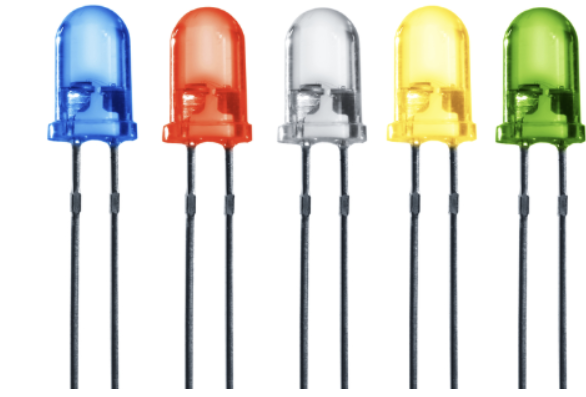

#

# Take 1 - Smart Office Status Indicator

An LED **(Light Emitting Diode)** is a semiconductor device that emits light when an electric current passes through it.

Key Characteristics of LED light:

| **Feature**           | **Description**                                                            |
| --------------------- | -------------------------------------------------------------------------- |
| Light Emission        | Emits light (visible, infrared, or ultraviolet) when powered.              |
| Polarity Sensitive    | Has two terminals: Anode (+) and Cathode (–); must be connected correctly. |
| Low Power Consumption | Very efficient, uses less power than traditional bulbs.                    |
| Long Lifespan         | LEDs can last tens of thousands of hours.                                  |

An **Anode**and a **Cathode** are the two terminals of an electronic component, like a diode, LED, or battery, and they determine the direction of current flow.

| **Term**    | **Symbol** | **Function**                                               | **Current Flow** |
| ----------- | ---------- | ---------------------------------------------------------- | ---------------- |
| **Anode**   | **(+)**    | Terminal where current enters a device (conventional flow) | **IN**           |
| **Cathode** | **(-)**    | Terminal where current exits a device                      | **OUT**          |

## In an LED (Light Emitting Diode):

| **Terminal**    | **Description**                      | **Identification**                |
| --------------- | ------------------------------------ | --------------------------------- |
| **Anode (+)**   | Connects to **Positive (+)** voltage | **Longer leg**, or flat-free side |
| **Cathode (-)** | Connects to **ground/negative (–)**  |                                   |

## Scenario

You are hired to build a Smart Office Status Light System.

The manager wants:

- 🟢 Green LED ➡️ **System Ready**

- 🔴 Red LED ➡️ **System Busy**

- LEDs must toggle automatically every 3 seconds

- Status must print in Serial Monitor

**Use Wokwi to test you code** https://wokwi.com/projects/456338531338776577

#

# Task 2 - LED Sequence Controller

## Scenario

You are designing a decorative smart lighting strip for a showroom.

The client wants:

- 🟣 🟡 🟢 Three LEDs turn **ON** one-by-one

- Then turn **OFF** in **reverse order**

- Repeat forever

**Use Wokwi to test you code** https://wokwi.com/projects/456341115898506241
