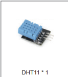
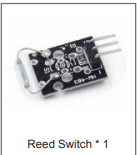
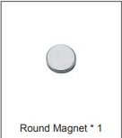
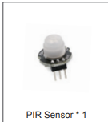
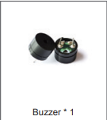

## DHT11 Sensor Overview

The DHT11 is a basic digital sensor used to measure temperature and humidity. It is widely used in DIY electronics, IoT projects, and embedded systems due to its simplicity and low cost.



### Key Features of DHT11:

|Feature     |Description  |
|---------|---------|
|Temperature Range | 0°C to 50°C |
|Humidity Range | 20% to 90% |
|Accuracy | ±2°C for temperature, ±5% for humidity |
|Supply Voltage | 3.3V to 5.5V |
|Current Consumption | 0.3mA (measuring), 60µA (idle) |

The DHT11 sensor contains two main components:

**1. NTC thermistor**– for measuring temperature.

**2. Capacitive humidity sensor**– for measuring relative humidity.

These components are connected to a chip inside the sensor that:

- Measures the analog data.
- Converts it to a digital format.
- Sends it to the microcontroller (e.g., Raspberry Pi Pico) via a single digital pin.

**Example code:**
```c++
#include "DHT.h"    
#define DHTPIN 2     // Pin where the DHT11 is connected
#define DHTTYPE DHT11   // DHT 11
DHT dht(DHTPIN, DHTTYPE); // Initialize DHT sensor
void setup() {
  Serial.begin(9600); 
  dht.begin(); // Start the DHT sensor
}
void loop() {
  delay(2000); // Wait a few seconds between measurements
  float humidity = dht.readHumidity(); // Read humidity
  float temperature = dht.readTemperature(); // Read temperature in Celsius
  Serial.print("Humidity: ");
  Serial.print(humidity);
  Serial.print(" %\t");
  Serial.print("Temperature: ");
  Serial.print(temperature);
  Serial.println(" *C");
}
```
### Code Breakdown
- `#include "DHT.h"` — This line tells the Arduino to include the DHT library, which contains predefined functions for working with the DHT11 sensor.
- `#define DHTPIN 2` — This line defines a constant named `DHTPIN` and assigns it the value `2`, indicating that the DHT11 sensor is connected to digital pin 2 on the Arduino.
- `#define DHTTYPE DHT11` — This line defines a constant named `DHTTYPE` and assigns it the value `DHT11`, specifying the type of DHT sensor being used.
- `DHT dht(DHTPIN, DHTTYPE);` — This line creates
- an instance of the DHT class named `dht`, initializing it with the pin and sensor type defined earlier.
- `void setup() { ... }` — This function runs once when the Arduino starts. It initializes the serial communication and starts the DHT sensor.
- `void loop() { ... }` — This function runs repeatedly after the setup. It reads the humidity and temperature from the DHT11 sensor every 2 seconds and prints the values to the serial monitor.
- `delay(2000);` — This line causes the program to wait for 2000 milliseconds (2 seconds) before taking the next reading, ensuring that the sensor has enough time to stabilize between measurements.
- `float humidity = dht.readHumidity();` — This line calls the `readHumidity()` function from the DHT library to get the current humidity reading and stores it in a variable named `humidity`.
- `float temperature = dht.readTemperature();` — This line calls the `readTemperature
- ()` function from the DHT library to get the current temperature reading in Celsius and stores it in a variable named `temperature`.
- The `Serial.print()` and `Serial.println()` functions are used to display the humidity and temperature readings in a readable format on the serial monitor.
- The output will show the humidity percentage followed by the temperature in degrees Celsius, updating every 2 seconds.
- **_Live Demo_** https://wokwi.com/projects/459361041121863681
  
  ## library installation
To use the DHT11 sensor with your Arduino, you need to install the DHT library. Here’s how you can do it:
1. Open the Arduino IDE.
2. Go to **Sketch** > **Include Library** > **Manage Libraries**.
3. In the Library Manager, type "DHT sensor library" in the search bar.
4. Find the library by Adafruit (or the one you prefer) and click "Install".
5. Once the library is installed, you can include it in your sketch using `#include "DHT.h"` and start using the functions provided by the library to read data from the DHT11 sensor.
6. Make sure to connect the DHT11 sensor correctly to your Arduino, with the data pin connected to the specified digital pin (e.g., pin 2 in the example code) and the power and ground pins connected appropriately.
7. After uploading the code to your Arduino, open the Serial Monitor (Ctrl + Shift + M) to see the humidity and temperature readings from the DHT11 sensor.
   

  ### Task 1: Weather Station
  ### Scenario:
You are working as an IoT technician for a succulent plant nursery, which requires a controlled environment to ensure optimal plant growth. Succulents thrive in warm, dry conditions and are sensitive to high humidity and cold temperatures. The nursery wants a basic real-time monitoring system to track the temperature and humidity inside the greenhouse.

### Objective:
Develop a MicroPython program using a DHT11 sensor connected to GPIO15 on a Raspberry Pi Pico. The script continuously measures environmental conditions and classifies them into one of four categories:

- Hot and Humid
- Hot and Dry
- Cool and Humid
- Cool and Dry
  
These readings help the nursery staff make decisions about:
- Ventilation
- Heating
- Watering schedules
### Requirement:
The client specifically asked that the decision-making process must use nested if statements to demonstrate structured conditional logic. This will allow students and technicians to practice reading multi-level conditions.

**Decision Logic (Nested If Example):**


```cpp
if (temperature > 25) {
  if (humidity > 60) {
    Serial.println("Hot and Humid");
  } else {
    Serial.println("Hot and Dry");
  }
} else {
  if (humidity > 60) {
    Serial.println("Cool and Humid");
  } else {
    Serial.println("Cool and Dry");
  }
}
```
### Code Breakdown
- The outer `if` statement checks if the temperature is greater than 25°C. If this condition is true, it indicates that the environment is hot.
- Inside the first `if` block, there is a nested `if` statement that checks
- if the humidity is greater than 60%. If this condition is true, it prints "Hot and Humid"; otherwise, it prints "Hot and Dry".
- If the outer `if` condition is false (temperature is 25°C or below),
- the `else` block is executed, which contains another nested `if` statement that checks the humidity level. If the humidity is greater than 60%, it prints "Cool and Humid"; otherwise, it prints "Cool and Dry".
- This structure allows the program to classify the environmental conditions based on both temperature and humidity, providing actionable insights for the nursery staff to maintain optimal conditions for the succulents.


### Hardware Requirements:
- ESP32 Microcontroller
- DHT11 Temperature & Humidity Sensor
- Jumper wires
- Breadboard 

## Reed Switch Sensor Overview

**A reed switch** is a small electromechanical switch that opens or closes in the presence of a magnetic field. It is often used as a door/window sensor in alarm and security systems.

       

***A reed switch consists of:***

- Two thin ferromagnetic metal reeds (contacts)
- Encased inside a glass tube
- Normally slightly separated (open)

When a magnet is brought close to the reed switch, the magnetic field causes the reeds to attract each other, closing the circuit and allowing current to flow. When the magnet is removed, the reeds return to their original position, opening the circuit.

### When a magnet comes close to the switch:

|Without Magnet |With Magnet |
|---------|---------|
|Contacts are open (No Connection).     |   Magnetic field pulls reeds together → closed (connected)      |
 ### Working Principle


|State  |Description  |
|---------|---------|
|Door Closed    | Magnet is near → switch closes → circuit is complete        |
|Door Open     | No magnet → switch opens → circuit is open        |
```cpp
if (doorState == HIGH) {
  Serial.println("Door is Open");
} else {
  Serial.println("Door is Closed");
}
```
### Code Breakdown
- `if (doorState == HIGH) { ... }` — This conditional statement checks if the variable `doorState` is equal to HIGH (indicating that the door is open). If this condition is true, it executes the code inside the curly braces, which prints "Door is Open" to the serial console.
- `else { ... }` — This part of the conditional statement executes if the previous condition is false (indicating that the door is closed). It prints "Door is Closed" to the serial console.
- The `Serial.println()` function is used to send the output to the serial monitor, allowing you to see the status of the door in real-time. Depending on the state of the reed switch (open or closed), the appropriate message will be displayed, helping you monitor the door's status effectively.

**Note:** If you're using it with a Raspberry Pi Pico or ESP32, it’s common to use an internal pull-up resistor, so:

- Closed = 0 (LOW)
- Open = 1 (HIGH)

## Task 2: Smart Door Monitoring System for a Pet Shelter
### Scenario
You are working as an IoT developer for a local animal shelter that wants to ensure the safety of pets, especially during night hours. The shelter has installed magnetic door sensors on all the interior doors of animal enclosures. These sensors will help staff monitor whether any enclosure door is accidentally left open.

### Objective
Develop a basic MicroPython script for a Raspberry Pi Pico that detects the state of a magnetic door sensor attached to GPIO. The system should continuously check the door status and print whether the door is OPEN or CLOSED to the serial console every second.

### Hardware Requirements
- Raspberry Pi Pico /ESP32 Microcontroller
- Reed switch sensor (door sensor)
- Magnet
- Jumper wires
- Breadboard
```cpp
const int doorSensorPin = 14;

void setup() {
  Serial.begin(9600);
  pinMode(doorSensorPin, INPUT_PULLUP);
}

void loop() {
  int doorState = digitalRead(doorSensorPin);

  if (doorState == LOW) {   // Magnet is near → door closed
    Serial.println("Door is CLOSED");
  } else {
    Serial.println("Door is OPEN");
  }

  delay(1000);
}
```
### code breakdown
- `const int doorSensorPin = 14;` — This line defines a constant integer    
- named `doorSensorPin` and assigns it the value `14`, indicating that the reed switch sensor is connected to GPIO pin 14 on the Raspberry Pi Pico.
- `void setup() { ... }` — This function runs once when the Raspberry Pi Pico starts. It initializes serial communication at a baud rate of 9600 and sets the `doorSensorPin` as an input with an internal pull-up resistor.
- `void loop() { ... }` — This function runs repeatedly after the setup. It reads the state of the door sensor every second and prints whether the door is OPEN or CLOSED to the serial console.
- `int doorState = digitalRead(doorSensorPin);` — This line reads the digital state of the `doorSensorPin` and stores it in the variable `doorState`. The value will be LOW (0) when the magnet is near (door closed) and HIGH (1) when the magnet is away (door open).
- The `if` statement checks the value of `doorState` and prints the corresponding message to the serial console. If `doorState` is LOW, it indicates that the door is CLOSED; otherwise, it indicates that the door is OPEN.
- `delay(1000);` — This line causes the program to wait for 1000 milliseconds (1 second) before taking the next reading, ensuring that the status is updated every second without overwhelming the serial console with too many messages.
#
## Passive Infrared (PIR) Sensor Overview
A Passive Infrared (PIR) sensor is an electronic device that detects motion by measuring changes in infrared radiation (heat) emitted by objects in its field of view. It is commonly used in security systems, automatic lighting, and occupancy sensing.



### Key Features of PIR Sensors:
|Feature     |Description  |
|---------|---------|
|Detection Range | Typically 5-12 meters |
|Field of View | Usually around 110-180 degrees |
|Power Supply | 3.3V to 5V |
|Output Type | Digital (HIGH/LOW) |
### Working Principle
PIR sensors consist of a pyroelectric sensor that detects infrared radiation. When a warm object (like a human or animal) moves within the sensor's field of view, it causes a change in the infrared radiation levels. The sensor detects this change and outputs a digital signal (HIGH when motion is detected, LOW when no motion is detected).
```cpp    
if (motionDetected) {
  Serial.println("Motion Detected!");
} else {
  Serial.println("No Motion");
}
```

### Code Breakdown
- `if (motionDetected) { ... }` — This conditional statement checks if the variable `motionDetected` is true (indicating that motion has been detected by the PIR sensor). If it is true, it executes the code inside the curly braces, which prints "Motion Detected!" to the serial console.
- `else { ... }` — This part of the conditional statement executes if `motionDetected` is false (indicating that no motion has been detected). It prints "No Motion" to the serial console.
- The `Serial.println()` function is used to send the output to the serial monitor, allowing you to see the status of motion detection in real-time.


## Passive Buzzer Overview
A passive buzzer is an electronic component that produces sound when an electric current is applied. Unlike an active buzzer, which has a built-in oscillating circuit and only requires a DC voltage to produce sound, **A Passive Buzzer** requires an external signal (like a square wave) to generate sound. This allows for more control over the tone and duration of the sound produced.


### Key Features of Passive Buzzers:
|Feature     |Description  |
|---------|---------|
|Operating Voltage | 3V to 5V |
|Sound Generation | Requires external signal (e.g., PWM) |
|Control | Can produce different tones and durations |
### Working Principle
To use a passive buzzer, you typically connect it to a microcontroller pin and use Pulse Width Modulation (PWM) to generate sound. By varying the frequency of the PWM signal, you can produce different tones. The duration of the sound can be controlled by how long you keep the signal active.
```cpp    
const int buzzerPin = 12;

void setup() {
  tone(buzzerPin, 1000);   // Play a 1000 Hz tone
  delay(1000);             // Wait for 1 second
  noTone(buzzerPin);       // Stop the tone
}

void loop() {
}
```

### Code Breakdown
- `tone(buzzerPin, 1000);` — This function generates a square wave of 1000 Hz on the pin defined by `buzzerPin`, causing the passive buzzer to produce a sound at that frequency.
- `delay(1000);` — This line causes the program to wait for 1000 milliseconds (1 second) while the tone is playing.
- `noTone(buzzerPin);` — This function stops the tone being generated on the `buzzerPin`, silencing the buzzer after the specified duration.
- The `setup()` function initializes the tone and duration, while the `loop()` function is empty in this example, as the sound is only played once during setup. You can modify the code to play different tones or create patterns by using loops and varying the frequency and duration of the tones.
  
## Task 3: Smart Door Alert System

### Scenario
 A small museum wants to protect its storage room, where rare artifacts are kept overnight. They need a low-cost door alarm that alerts staff if the storage door is opened outside of working hours. The system should:

- Stay silent when the door is closed.
- Blink an LED and sound a buzzer if the door is opened.
- Resets automatically when the door is closed again.
  
The museum security team will use this alarm as the first line of defence before motion detectors and CCTV cameras are activated.

### Learning Objectives
By completing this task, you will learn to:

- Use a digital input sensor (reed switch) with a microcontroller.
- Control an LED and a passive buzzer using output pins.
- Implement flat logic with if/elif/else (no nested if/loops).
- Apply timing with sleep() to create blinking and beeping patterns.
- Understand how such systems can be applied in real-world security (museums, offices, shops).
### Hardware Requirements
- Raspberry Pi Pico /ESP32 Microcontroller
- Magnetic reed switch (door sensor)
- Small magnet
- LED (any colour)
- Passive buzzer
- Breadboard
- Jumper wires

## Task 4: Smart Temperature Alert System for a Community Garden
### Scenario
You have been hired as an embedded systems developer for a community garden project. The garden includes several temperature-sensitive plants, and the community members want to be alerted about extreme weather conditions, especially during heat waves and cold nights.

To support this, a Raspberry Pi Pico and a DHT11 sensor are installed in the garden's main greenhouse to monitor the temperature and classify it into meaningful categories for volunteers.

### Objective:
Design a MicroPython program that:

- Measures the temperature using a DHT11 sensor on GPIO 15
- Uses if-elif-else conditional logic to print temperature warnings or status messages every 2 seconds
- Helps volunteers make decisions such as when to:
  - Ventilate the greenhouse
  - Cover plants from the cold
  - Add water or shade during heat
  ### Code Logic Overview
The program will read the temperature from the DHT11 sensor and classify it into one of the following categories:    
- "Too Cold" (below 10°C)
- "Cold" (10°C to 15°C)
- "Optimal" (15°C to 25°C)
- "Hot" (25°C to 30°C)
- "Too Hot" (above 30°C)
- Each category will trigger a specific message to guide the volunteers in taking appropriate actions to protect the plants.

### Hardware Requirements
- Raspberry Pi Pico /ESP32 Microcontroller
- DHT11 Temperature & Humidity Sensor
- Jumper wires
- Breadboard
  
  